# market_wechat_bot
**自用微信股票看盘机器人**

---
本项目是一个微信机器人，将A股、港美股、Crypto等数据整合到微信中。

在微信群里查看股票走势，方便群友讨论。

## 核心功能
- **实时价格与 K 线查询**：
  - 支持根据股票代码、名称、缩写及加密货币的实时价格查询。
- **群消息分析与回应**：
  - 对微信消息进行分析并采取不同的响应策略。
  - 提供简单的 AI 聊天功能。
- **主动消息推送**：
  - 推送大盘异动、每日龙虎榜、新闻联播、板块热力图等关键信息。
---

## 模块说明
### docker_wechat（docker微信）
- 运行在docker中的微信机器人，公开项目中不方便展示过多信息。
- 通过http接收发送消息请求，通过socket向外传递收到的微信消息。

### message_handle（消息处理逻辑）
-  用于处理微信消息，对接收到的微信消息进行分析，采取不同的回应。
-  据接收到的**股票代码/股票名称/缩写/加密货币**进行实时的价格和k线查询。
-  接入GPT的api进行简单的**AI chat**。
-  设置**价格监控**
-  快速下单

####  `distributed/agent.go`
- 与docker微信建立socket链接，转发微信发出来的消息到`flask_server`
- **优化**：一开始直接使用python的socket监听，但是cpu占用率奇高，原因不详，换成Golang转发后就好了
#### `wechat_handle`
- 处理收到的微信消息逻辑，对消息进行分类处理
#### `push_info`
- 主动消息推送的脚本，主要用于推送**大盘异动**，每日**龙虎榜**，每日**新闻联播**，**板块热力图**等。
#### `flask_server`
- 启一个flask服务，接收来自agent的消息，调用`wechat_handle`进行处理
#### `api/logging.py`
- 自用log模块，方便debug
- 自动识别当前运行的脚本名，将log输出到对应文件夹中
- 按照日期分割保存，方便查询（详见项目示例）
### server（提供数据的服务）
部署各类数据的查询服务
#### `quote_server`
- 调用各个交易所的API，查询港美股或比特币实时价格（A股的查询已从该模块移除，因为可以直接爬取某证券网页的接口，放在`wechat_handle`中直接处理即可）
- 币圈价格监控，支持设置需要报警的目标价，到达目标价位后主动发送微信通知
- 调用交易所API快速下单，以当前最优的价格下单，用于0挂单费的交易对，确保是Maker单
- 提供其他与交易所api相关的请求，如查询我的账户股票持仓。
#### `image_server`
- 启动一个虚拟浏览器，模拟网页操作，爬取一定的数据。因为启动浏览器比较吃资源，因此单独部署到一台服务器上
- 通过**模拟**某些证券网页的搜索操作，将微信消息中提到的**股票代码/股票名称/缩写**等转化为唯一的股票代码，方便进一步查询
- 对一些网页进行截图（如每日龙虎榜，股票热力图）
#### `holds_record`
- 从另一个项目中迁移过来的，一开始是一个单独的脚本，每天收集各大交易所的持仓数据和盈亏情况，
- 进行数据分析后绘制成表格和饼图，每天发送到本人的邮箱中。
- 迁移到本项目中后，支持在微信中一键查询当前的持仓情况
#### `sip`
- 每日定投脚本，私人用，本项目中未展出

## 项目示例
### 股票查询
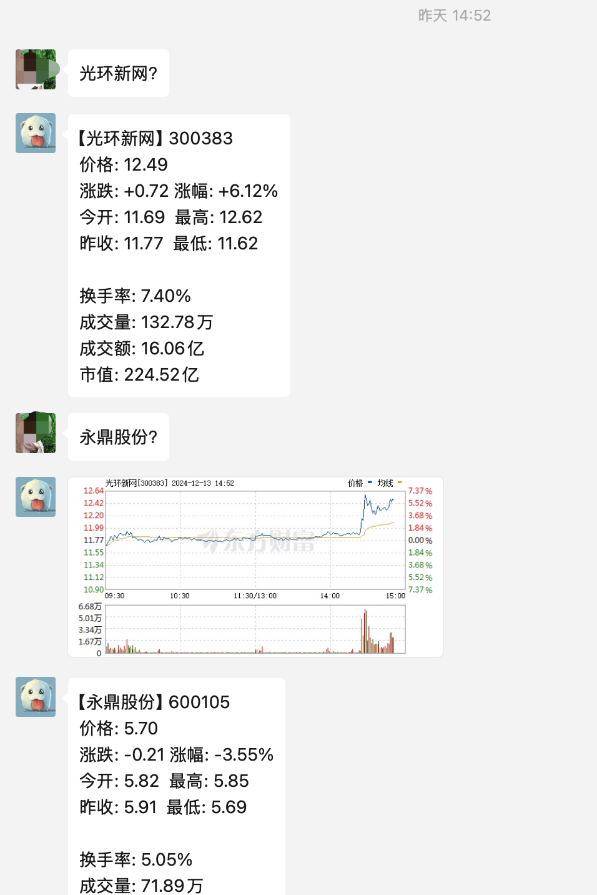
### 大盘异动
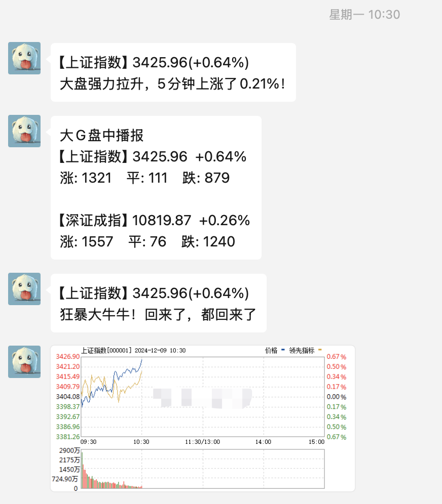
### 定时播报
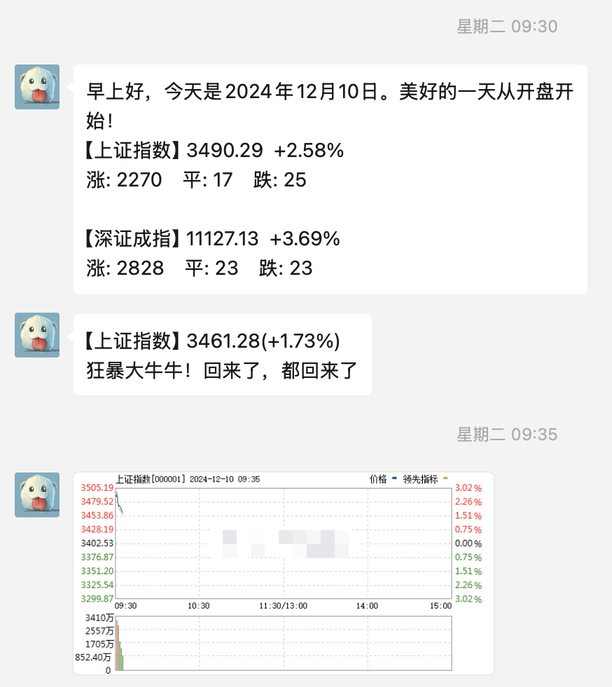
### 港美股查询
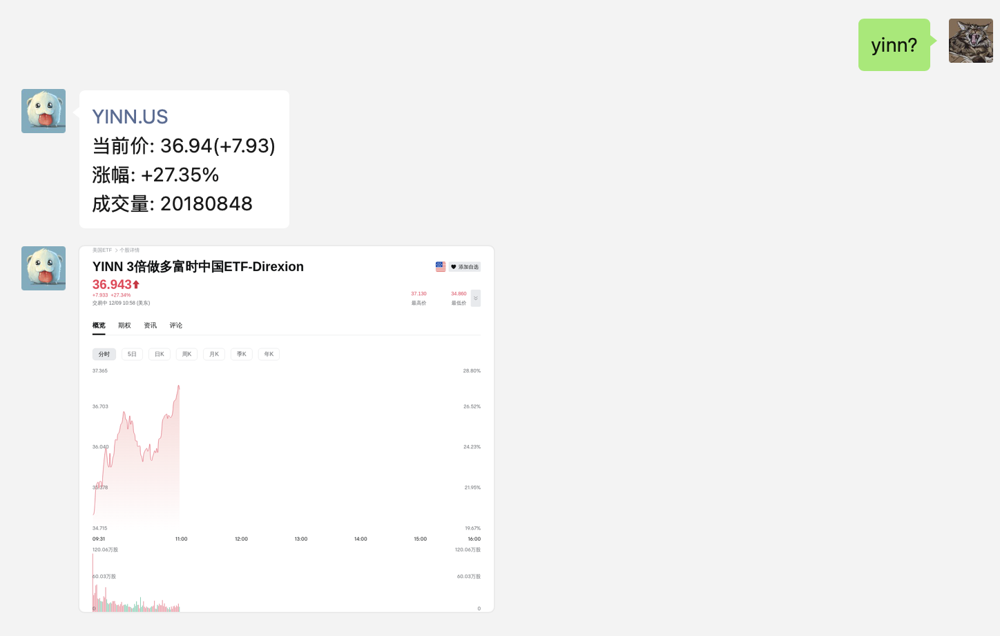
### 龙虎榜推送
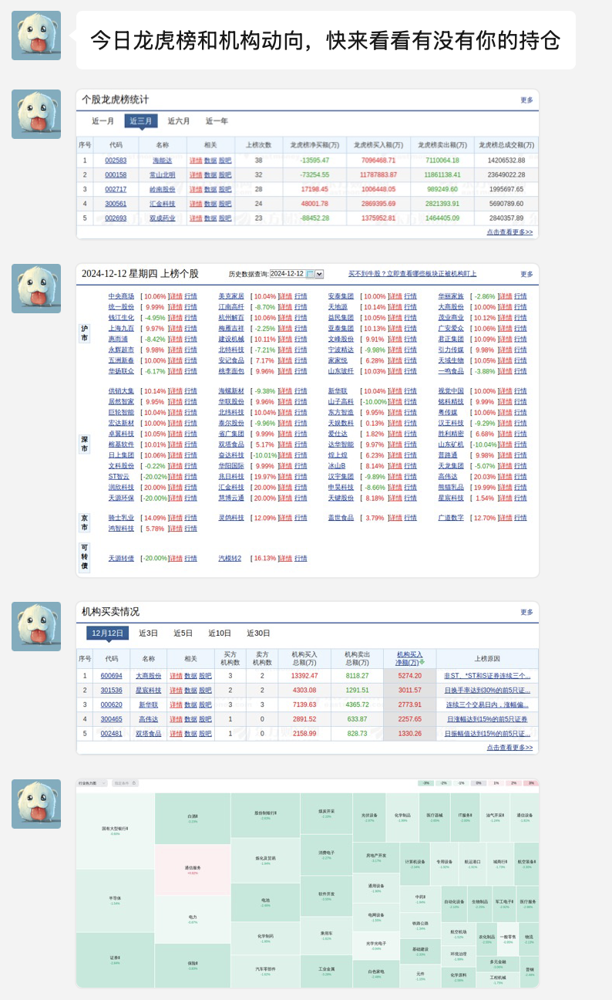
### 新闻联播推送
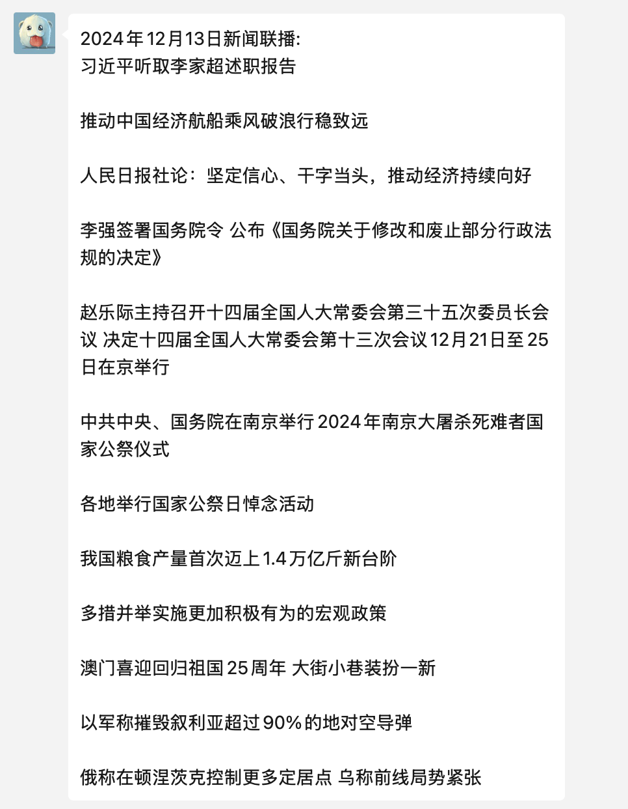
### 价格监控报警
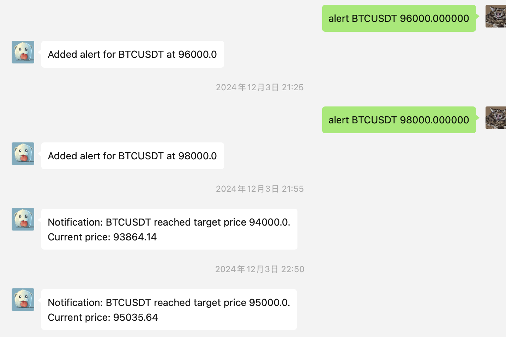
### 定投日报
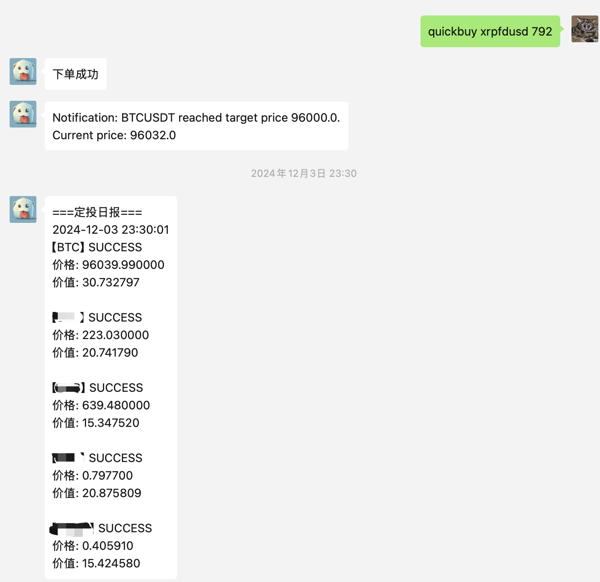
### 个人仓位查询
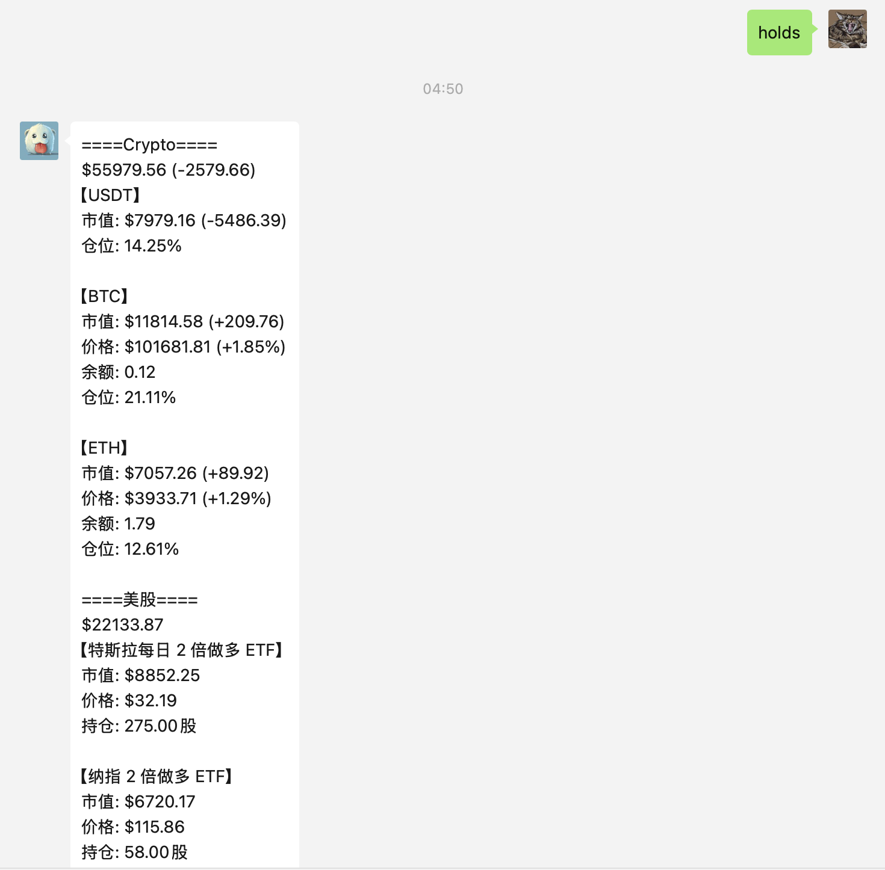
### 每日邮箱推送
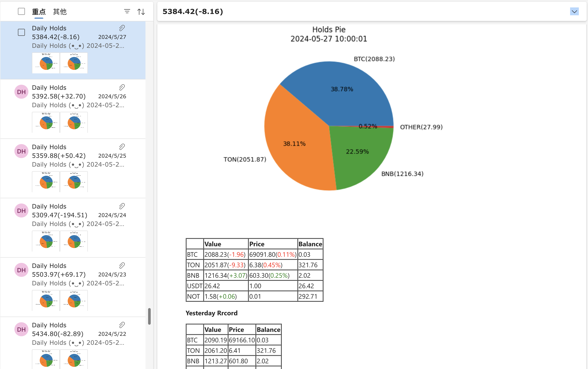
### 日志模块
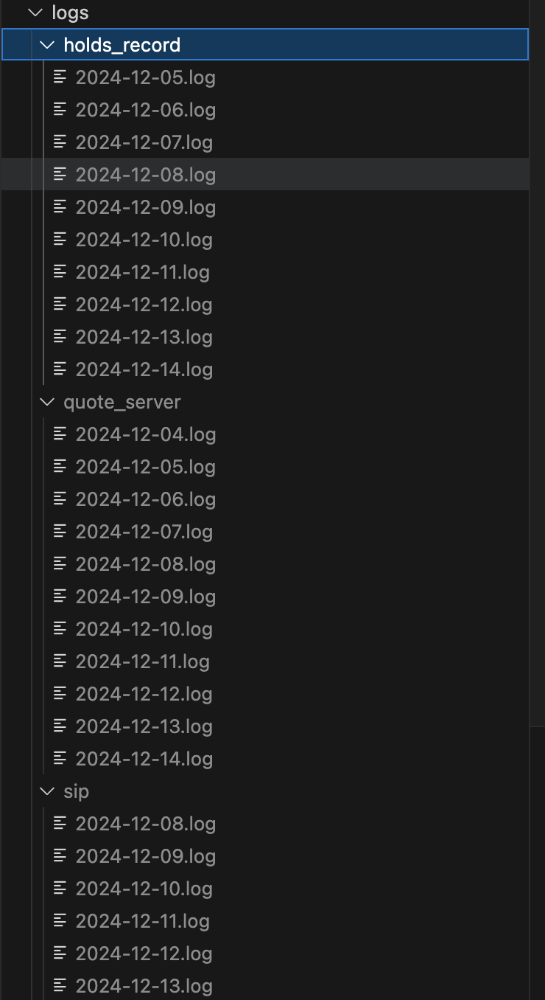

## 项目说明
由于需要配置的环境较复杂，本项目仅供代码参考，欢迎提交 Issue 一起讨论研发新功能。